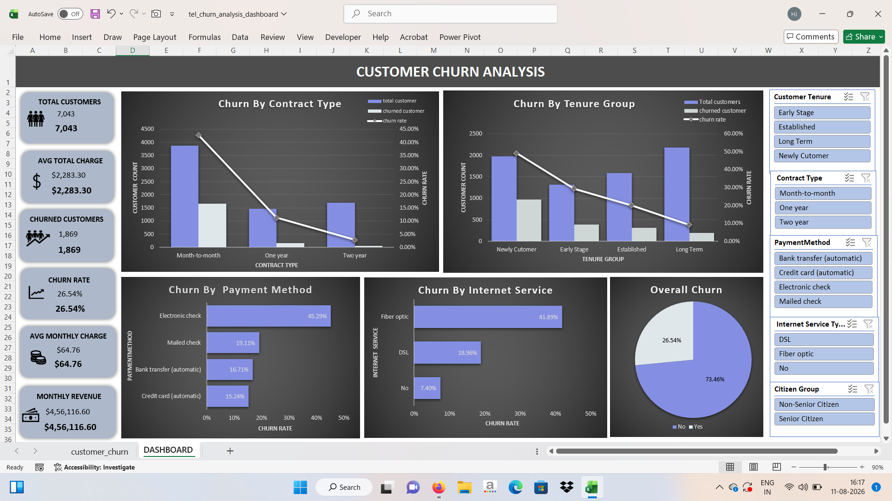
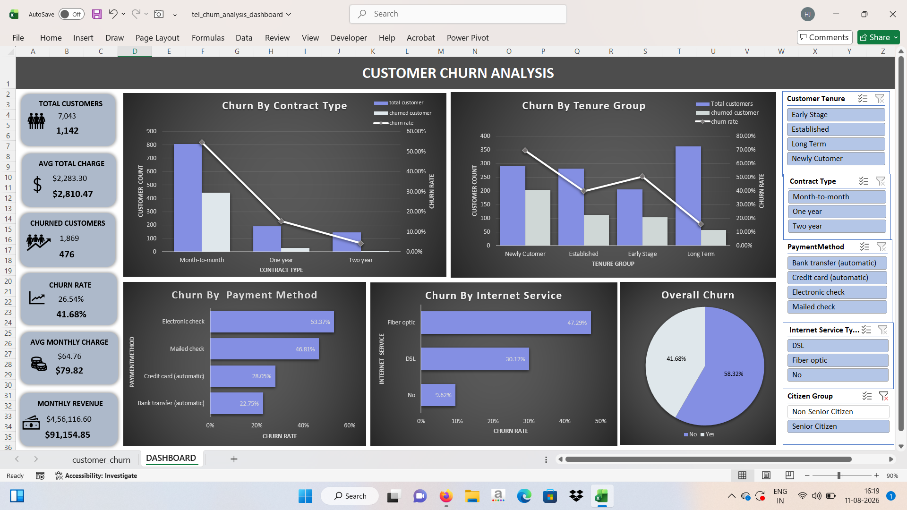
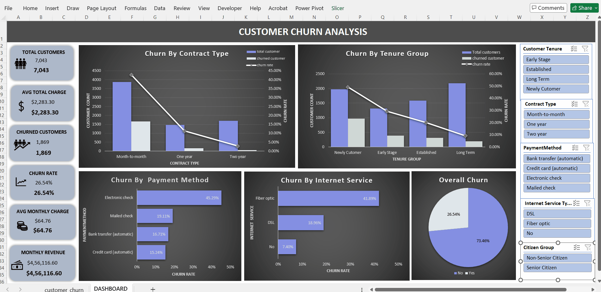

# Excel-data-analytics-projects
A collection of Excel data analytics projects featuring data cleaning, analysis, interactive dashboards, Power Query, Power Pivot, DAX, PivotTables, and visualization.

# 📊 Customer Churn Analysis Dashboard 

An interactive Customer Churn Analysis dashboard developed in Microsoft Excel to analyze customer behavior, identify churn patterns, and compare churn across different customer segments.

The project uses Power Query for data cleaning, Power Pivot and DAX for calculations, and PivotTables, PivotCharts, and Slicers to create an interactive dashboard.

---

## 📌 Project Overview

Customer churn is a major business challenge because losing existing customers can directly affect revenue and growth.

This project analyzes customer churn data to answer questions such as:

- What percentage of customers have churned?
- Which contract type has the highest churn?
- Does customer tenure affect churn?
- Which internet service has the highest churn?
- Which payment method is associated with higher churn?
- How does churn change when different customer segments are selected?

---

## 🛠️ Tools & Technologies

 - **Microsoft Excel**
- **Power Query** — Data cleaning and transformation
- **Power Pivot** — Data modeling
- **DAX** — Measures and calculations
- **PivotTables** — Data analysis
- **PivotCharts** — Data visualization
- **Slicers** — Interactive filtering

---

## 🧹 Data Cleaning & Transformation

Key cleaning and transformation steps included:

- Checked for duplicate Customer IDs.
- Reviewed missing and null values in the dataset.
- Retained null values in `TotalCharges` because they correspond to newer customers with no accumulated total charges yet.
- Verified the existing data types.
- Checked categorical fields for consistency.
- Prepared the transformed data for analysis using PivotTables and Power Pivot.

### 📌 Derived Columns

Two derived columns were created to support customer segmentation and analysis:

- **Tenure Group** — grouped customers based on their tenure to analyze how churn varies across different customer lifecycle stages.
- **Citizen Group** — categorized customers into Senior Citizen and Non-Senior Citizen groups for segment-level churn analysis.

---

## 📌 Key Performance Indicators (KPIs)

| KPI | Value |
|---|---:|
| Total Customers | **7,043** |
| Churned Customers | **1,869** |
| Churn Rate | **26.54%** |
| Average Monthly Charges | **$64.76** |
| Average Total Charges | **$2,283.30** |
| Monthly Revenue | **$4,56,116.60** |

The dashboard also displays dynamically filtered KPI values when slicers are selected, allowing comparison between overall values and selected customer segments.

--- 

## 📈 Dashboard Analysis

### 1. Churn by Contract Type
**Question:** Which contract type has the highest churn?

A combination chart compares customer volume and churn rate across contract types. Month-to-month customers show the highest churn rate, highlighting contract type as an important factor in customer retention.

### 2. Churn by Tenure
**Question:** How does customer tenure affect churn?

A combination chart compares customer volume and churn rate across different tenure groups. Customers with shorter tenure show higher churn, while churn generally decreases as tenure increases.

### 3. Churn by Internet Service
**Question:** Which internet service has the highest churn?

A bar chart compares churn rates across internet service categories. Fiber optic customers show a higher churn rate compared with the other service categories.

### 4. Churn by Payment Method
**Question:** Which payment method has the highest churn?

A bar chart compares churn rates across payment methods. Electronic check customers have the highest churn rate among the payment methods analyzed.

### 5. Overall Churn
**Question:** What is the overall customer churn rate?

A pie chart shows the overall churn distribution, with **26.54% of customers churned** and **73.46% retained**.

### 6. Customer Segmentation
**Question:** Does churn vary across customer segments?

Interactive slicers allow churn to be analyzed by Contract Type, Tenure Group, Payment Method, Internet Service, and Citizen Group. KPI values and charts dynamically update based on the selected segment.

---

## 🎛️ Interactive Dashboard

The dashboard includes slicers for:

- Contract Type
- Tenure Group
- Payment Method
- Internet Service
- Citizen Group

Selecting a slicer dynamically updates the relevant KPIs and charts, allowing customer churn to be analyzed across different customer segments.

---

## 💡 Key Insights

- **26.54% of customers have churned**, indicating a significant customer retention challenge.
- **Contract type shows noticeable differences in churn**, making contract structure an important area for retention analysis.
- **Tenure is associated with different churn patterns**, particularly across different customer lifecycle stages.
- **Electronic check customers have the highest churn rate among the payment methods analyzed.**
- **Internet service categories show noticeable differences in churn rates.**
- Customer segmentation using **Tenure Group** and **Citizen Group** allows churn behavior to be explored across different customer segments.

> These observations describe patterns in the dataset and should not automatically be interpreted as causal relationships.

---

## 💡 Business Recommendations

Based on the churn patterns identified in the analysis:

- Develop targeted retention strategies for **month-to-month customers**.
- Focus on **early-tenure customers** with stronger onboarding and engagement.
- Investigate the reasons for higher churn among **electronic check customers**.
- Further investigate high-churn **internet service segments** to identify potential service or pricing issues.

---

## 📷 Dashboard Preview

### 🔎 Filtered Dashboard — Senior Citizen Segment

The dashboard dynamically updates when a customer segment is selected. The example below shows the dashboard filtered for Senior Citizens.

### 🎥 Interactive Dashboard Demo

## 📁 Project Files

- `tel_churn_analysis_dashboard` — Excel workbook containing the cleaned data, Power Pivot measures, PivotTables, PivotCharts, slicers, and dashboard.
- `dashboard.png` — Dashboard preview.
- `citizen_filtered.png` — Dashboard view filtered to Senior Citizens.
- `dashboard_demo.gif` — Interactive dashboard demonstration.

## 🎯 Project Objective

The objective of this project is to demonstrate practical Excel data analytics skills by transforming customer churn data into an interactive dashboard that provides actionable insights into customer retention and churn patterns.

---

## 👤 Author

**Harsha Janardhanan**

Aspiring Data Analyst | Excel | SQL | Power BI | Python

📧 Email: harshajanardhanan2@gmail.com  
🔗 LinkedIn profile:**[Harsha Janardhanan](https://www.linkedin.com/in/harshajanardhanan/)**
